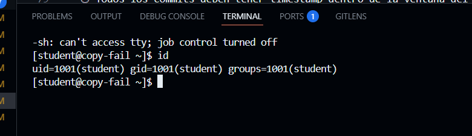
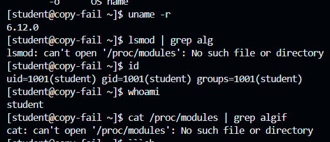
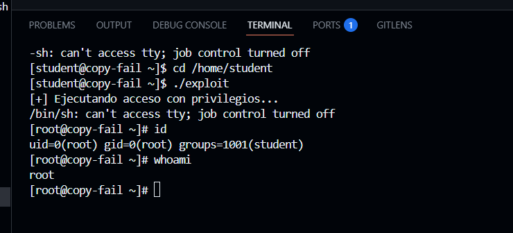
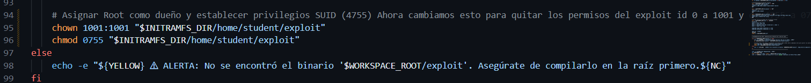
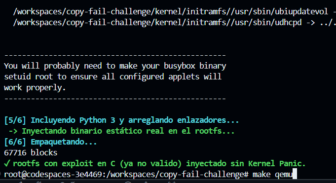

# Copy Fail — CVE-2026-31431 Lab
## Introducción a UNIX · UIDE · Evaluación Parcial 2 → 9 puntos

[](https://github.com/DOCENTE_REPO/copy-fail-challenge/actions/workflows/grade.yml)

---

Un bug lógico silencioso durante **casi una década** en el kernel Linux.
Un script de **732 bytes**. **Root** en todas las distribuciones mayores desde 2017.

Tu tarea: reproducirlo y parchearlo.

## Inicio rápido

```bash
# 1. Fork este repositorio a tu cuenta GitHub
# 2. Ábrelo en GitHub Codespaces
# 3. Dentro del devcontainer:

git config user.name "TuNombre TuApellido"
git config user.email "tu@uide.edu.ec"

make setup        # compila kernel vulnerable + rootfs (~20 min)
make qemu         # arranca la VM vulnerable

# ... sigue las instrucciones en CHALLENGE.md
```

## Estructura del repositorio

```
copy-fail-challenge/
├── .devcontainer/          ← Configuración del devcontainer (Ubuntu + QEMU)
│   ├── devcontainer.json
│   └── Dockerfile
├── .github/workflows/
│   └── grade.yml           ← Autocalificador de GitHub Actions
├── evidence/               ← TUS ARCHIVOS DE EVIDENCIA VAN AQUÍ
│   └── README.md
├── grader/
│   └── grade.py            ← Calificador local (make grade)
├── patches/                ← TU PARCHE VA AQUÍ (Hito 4)
│   └── README.md
├── scripts/
│   ├── 00_welcome.sh
│   ├── 01_build_kernel.sh  ← Compila Linux v6.12 (vulnerable)
│   ├── 02_build_rootfs.sh  ← BusyBox + Python rootfs
│   ├── 03_run_qemu.sh      ← Arranca la VM
│   └── 04_build_patched_kernel.sh
├── kernel/                 ← Fuentes del kernel (gitignore excepto config)
├── CHALLENGE.md            ← INSTRUCCIONES COMPLETAS DEL RETO
├── Makefile
└── README.md
```

## Hitos y puntuación

| # | Hito | Pts |
|---|------|-----|
| 1 | Kernel Linux 6.12 vulnerable corriendo en QEMU, `algif_aead` cargado | 2.0 |
| 2 | PoC ejecutado → `uid=0(root)` obtenido como usuario sin privilegios | 3.0 |
| 3 | Mitigación temporal: `rmmod algif_aead`, exploit falla | 1.5 |
| 4 | Parche en `crypto/algif_aead.c`, kernel recompilado, exploit falla | 2.0 |
| B | `REPORT.md`: explicación técnica con conexión a conceptos del curso | 0.5 |

## Recursos

- Write-up técnico: https://xint.io/blog/copy-fail-linux-distributions
- Sitio oficial del CVE: https://copy.fail/
- PoC público: https://github.com/theori-io/copy-fail-CVE-2026-31431
- Kubernetes escape (Parte 2): https://github.com/Percivalll/Copy-Fail-CVE-2026-31431-Kubernetes-PoC

## Reglas del examen

- ✅ Se permite todo recurso en internet, IA, documentación, write-ups
- ✅ Se permite (y se espera) leer el código del PoC público
- ❌ No se permite compartir archivos de evidencia entre estudiantes
- ❌ El hostname de tu VM debe ser único (viene de `git config user.name`)
- ⏱ Todos los commits deben tener timestamp dentro de la ventana del examen

---

*Basado en CVE-2026-31431 descubierto por Theori / Xint Code. Divulgado el 29 de abril de 2026.*

Hola commit uno, tratando de resolver el kernel panic
Hi, commit 2

Hito 1:


El kernel panic se daba ya que el kernel no podia ver el archivo /init al cambiar los scripts 02 y 01 se logro resolver el error -2 de kernel panic y entrar a la interfaz del qemu 

Commit 3: Ya se resolvio el kernel panic y qemu corre perfectamente

# HITO 1

Se compilo el kernel superando el kernel panic como se explico anteriormente

 

# HITO 2

A diferencia de lo que se hizo con el exploit de python yo utilice un exploit en c que establece el id como 0, mi resolucion para poder ser root se podria resumir como que iyectamos al exploit en c para que este en bin estatico en la construccion de la vm de ubuntu y al ejecutar este exploit usando codigo en c define el id como 0, dando permisos de root



# HITO 3

Ya que mi exploit es diferente lo que hice fue hacer un cambio de permisos del exploit con chmod y despues lo que hice fue deshabilitar los namespaces de usuario para romper el aislamiento del espacio de usuario con el segundo comando utilizando echo 0 direccionando esto con > asi, cambie de user a student otra vez para comprobar que el exploit ex invalido completamente y como se puede ver ya no funciona ya que sigo como student 
   

# HITO 4

En primera instancia se creo el archivo parche fix_algif_aead.patch 


Despues se modifico lo que cambie en el script 02 que otorgaba id 0 (ahora 1001) y permisos 4755 (ahora 0755) y se empaqueto todo con el cambio usando bash con el archivo modificado que en este caso fue 02, pero antes ya se utilizo al modificar el codigo del kernel para evitar el kernel panic



Y despues hacemos el make qemu con los cambios aplicados 



Y por ultimo verifique que mi exploit en c ya no funciona para hacerme root


